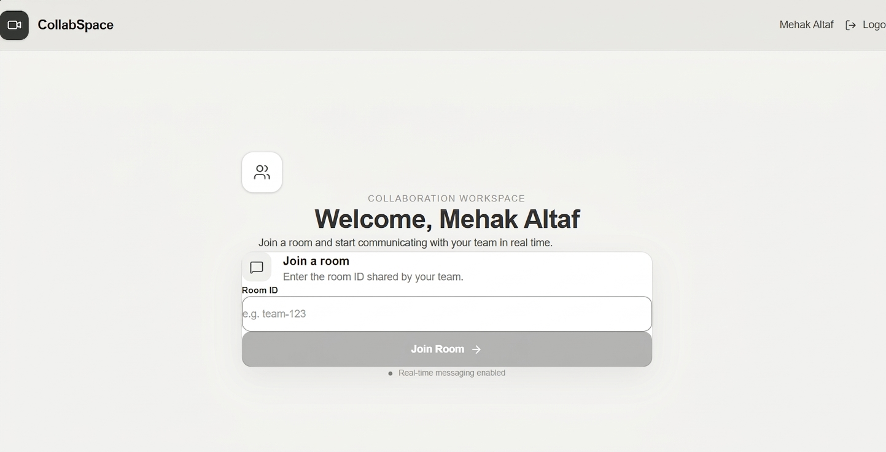
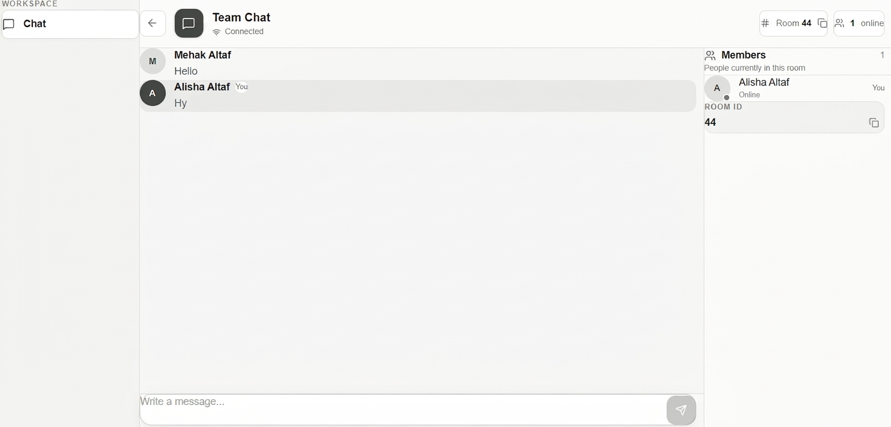

# 💬 CollabSpace — Real-Time Collaboration & Chat App

CollabSpace is a full-stack, real-time collaboration application built for seamless team communication. It features user authentication, instant messaging across custom rooms, active member tracking, and live typing indicators.

---

## ✨ Features

- 🔐 **User Authentication**: Secure signup and login workflow.
- ⚡ **Real-Time Messaging**: Instant socket-driven communication within active workspace rooms.
- 👥 **Room Management**: Join custom rooms instantly using unique Room IDs.
- 🟢 **Live Room State**: Real-time tracking of active room members and live typing feedback.
- 💾 **Message Persistence**: Complete message history stored securely in MongoDB.
- 🎨 **Minimalist UI**: Clean, responsive layout designed for focused collaboration.

---

## 🛠️ Tech Stack

- **Frontend**: React.js (Vite), Tailwind CSS / Custom CSS, Socket.io-client
- **Backend**: Node.js, Express.js, Socket.io
- **Database**: MongoDB (Mongoose ORM)
- **API & Protocols**: REST API, WebSockets (CORS enabled for multi-port environments)

---

## 📸 Application Preview

### 1. Authentication Page

### 2. Workspace Dashboard

### 3. Real-Time Team Chat

---

## 📁 Project Structure

RTCT/
├── backend/
│   ├── models/           # Mongoose schemas (User, Message)
│   ├── routes/           # REST endpoints (authRoutes, messageRoutes)
│   ├── server.js         # Express server & Socket.io handlers
│   └── .env              # Backend environment variables
├── frontend/
│   ├── src/              # React components, pages & socket logic
│   ├── vite.config.js    # Vite configuration
│   └── package.json
├── screenshots/          # Documentation image assets
└── README.md             # Project documentation